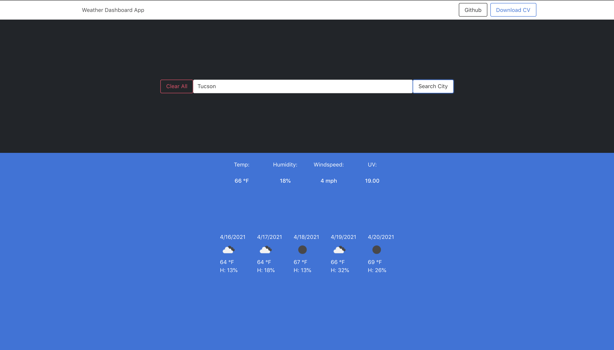

# # Weather App

Click on the following link to get to the application:
* [Weather App](https://noora1125.github.io/password/)

The following images demonstrates the application functionality:




### Summary
This weather dashboard app runs in the browser and feature dynamically updated HTML and CSS using Bulma & custom CSS where needed. The app uses OpenWeather API to retrieve live weather data for cities and Vanilla JS to make dynamic changes to the HMTL document. It uses localStorage to store any persistent data. 

## User Story

```
AS AN employee with access to sensitive data
I WANT to randomly generate a password that meets certain criteria
SO THAT I can create a strong password that provides greater security
```

## Application features

```
Encypted password:

WHEN clicked on the generate button,
A prompt for will pop up saying: "Enter A Password To Encrypt:" which requires the length of the inputted password to be at leat 8 characters and no more than 128 characters.
Then a the prompt will verify to confirm for password criteria to be 8 characters. 
I've included a lowercase, uppercase, numeric, and/or special characters popup, and new password length which allows you to decided what criteria you want the newpassword to have. It uses an array for each [lower Case, Cap Case, Numbers, Special Characters] and it adds or subsctracts based on your check box selection. So far, only the length works though.
After selected which criteria to include in the password,
The password is generated and the password is displayed in text area with the new criteria (length only for now).

```


